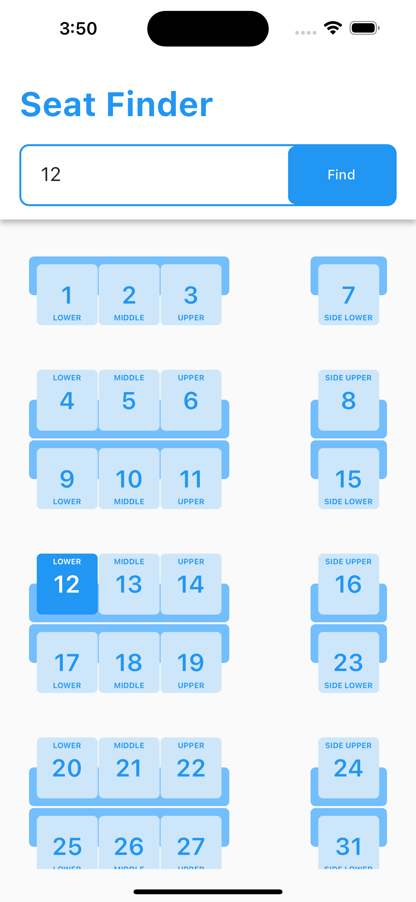
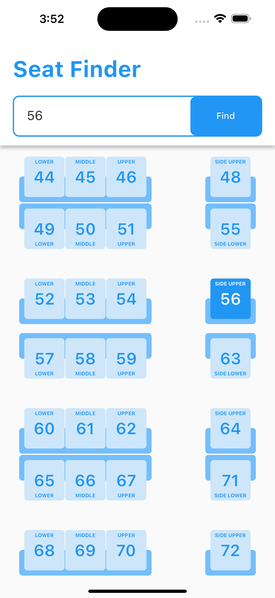

# seat_finder

Seat Finder - A Flutter Project.
- Used ScrollController to scroll to the paricular value.
- Also used Riverpod package to create a TextEditingController Provider to avoid passing the controller deep inside the leaf child (prop drilling) used for searching the seat value and changing the controller value when tapped on the seat widget.
- Video Link - https://drive.google.com/file/d/1Sfq0aIpNfS4D03aPKhYz35xPyw8UzeKq/view?usp=sharing

To run the project -
- Selct from the Run option of VS code - Start Debugging
- Or run command in terminal - flutter run

- Screenshot -

  <!-- 
   -->

  <tr>
    <td></td>
    <td></td>
  </tr>
